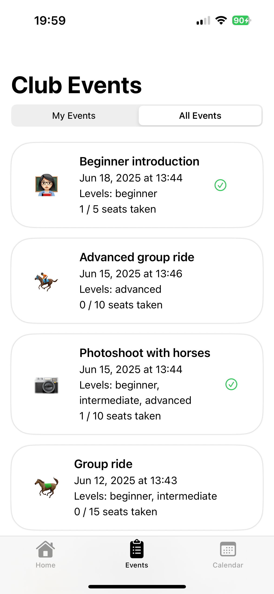
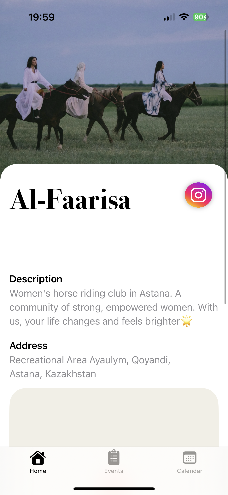
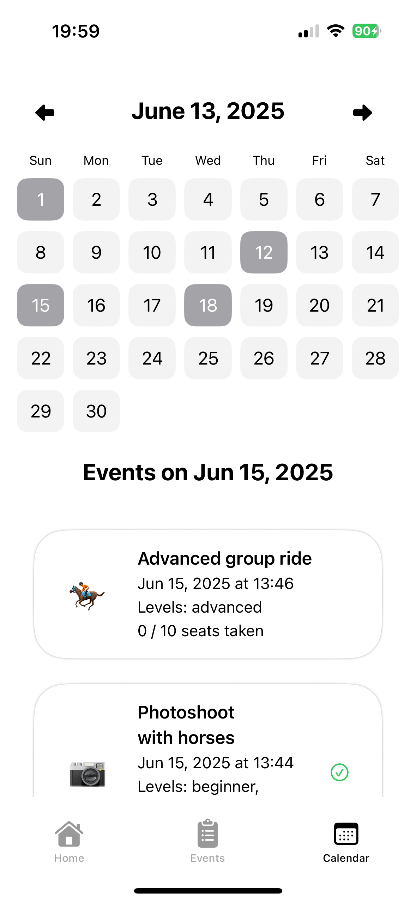
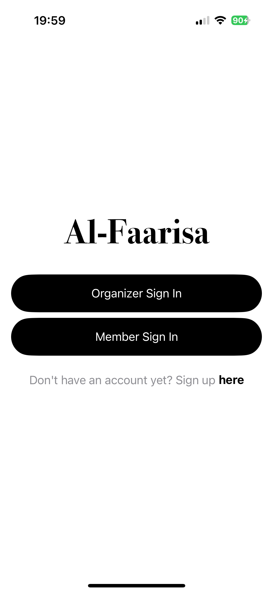
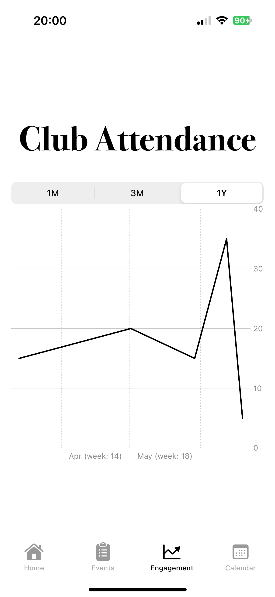
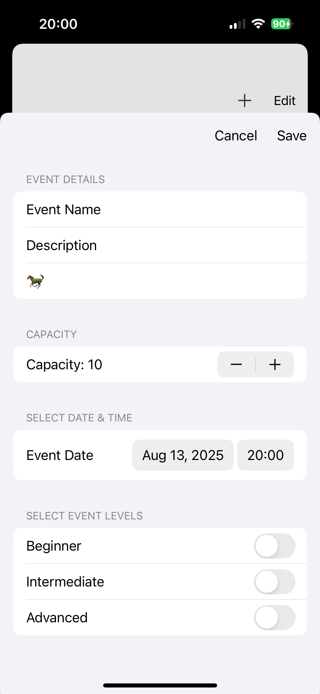

# Al-Faarisa Horse Riding Club Management App

This is a final project for CS 193P: iOS Application Development at Stanford University.

This iOS app supports two types of user accounts: **Club Organizer** and **Club Member**.  
It uses Firebase for authentication and real-time data storage.

## Screenshots

  
  
  

  
  
  

---

## Testing app locally: Sample Accounts

**Organizer Account**  
Email: amiram@stanford.edu
Password: 000000

**Member Account**  
Email: mahmedjan.amira@gmail.com
Password: 000000

---

## Creating a New Account

When signing up as an **Organizer**, you must provide a confirmation code to prevent random users from creating organizer accounts.

**Organizer Confirmation Code**  
ABCD

---

## Features

### Organizer
- **Edit Club Information**  
  - Accessible via the **Edit** button at the bottom of the Home page.  
  - Changes are stored in Firebase and persist across accounts.  
- **External Links**  
  - View club’s Instagram and location via external links.  
- **Event Management**  
  - Create new events, set capacity, date, etc.  
  - Delete events.  
  - All events are saved to Firebase and persist across accounts and app launches.  
- **Calendar View**  
  - Days with events are marked **gray**.  
- **Attendance View**  
  - Attendance over time is shown using the event **capacity** variable.  
  - *Note:* Attendee count is computed and not stored directly, so capacity is used as a proxy.  
- **Logout** functionality.  

---

### Member
- **View Club Information**  
  - Includes Instagram and club location via external links.  
- **Event Participation**  
  - Sign up for events.  
  - Filter events by **All** or **Mine**.  
  - Drop their spot at an event.  
- **Calendar View**  
  - Days with events are marked **gray**.  
  - Events the member signed up for are marked with a **checkmark**.  
- **Persistent Data**  
  - All changes to event attendees are reflected in Firebase and synced across all accounts and app launches.  

